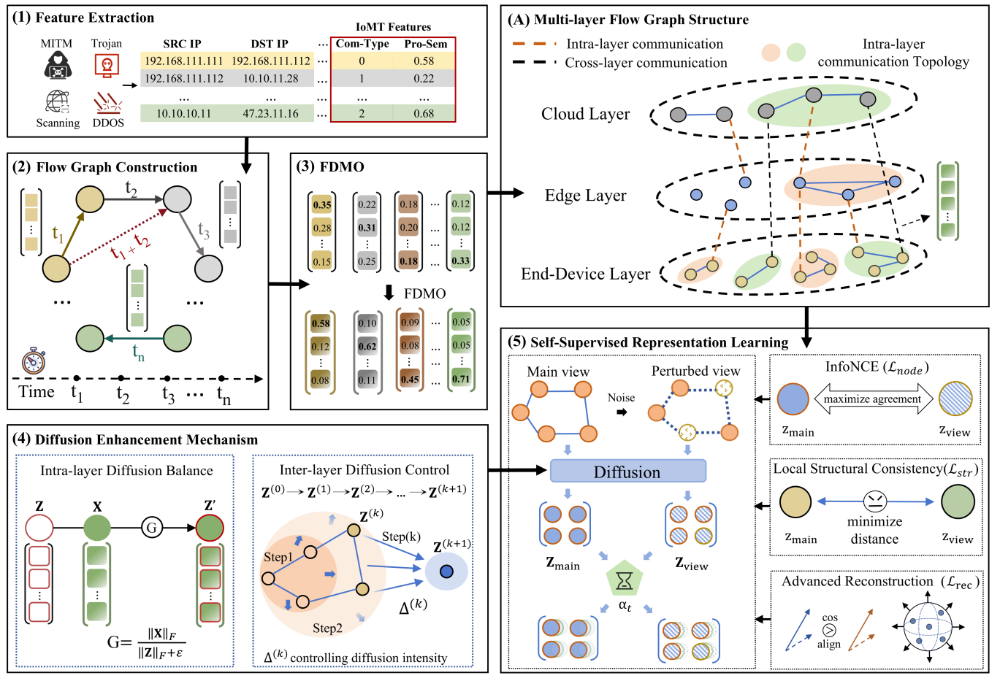

# Med-Diff: Evaluation & Testing Code

This repository hosts the official testing and evaluation scripts for **Med-Diff**.

To facilitate reproducibility for reviewers and other interested researchers, we organize experiments for different datasets into **separate directories**.

Each dataset directory contains its own `train.py`, `test.py`, and `checkpoints/` folder.  

Users can directly enter the corresponding dataset directory and run the provided scripts to reproduce the results.

**This design allows reviewers to easily reproduce the results by running the scripts within each dataset-specific directory.**


\---

\# 另外一个更简单的方法（我强烈推荐）

用 **4个空格缩进**：

\```markdown
\## Project Structure

​    .
​    ├── 2024-iomt-traffic-data/
​    │   ├── train.py
​    │   ├── test.py
​    │   └── checkpoints/
​    ├── CIC_IOMT_2024/
​    │   ├── train.py
​    │   ├── test.py
​    │   └── checkpoints/
\```

Markdown 会自动识别为代码块。

\---

\# 最推荐的论文仓库写法（更好看）

\```markdown
\## Project Structure

\```
Med-Diff
├── 2024-iomt-traffic-data
├── CIC_IOMT_2024
├── CIC_TON_IOT
├── NF-UNSW-NB15
├── data
├── model
├── utils
└── README.md
\```
\```

\---


## **Project Structure**

\````markdown
\## Project Structure

\```text
.
├── 2024-iomt-traffic-data/      # IoMT traffic dataset experiments
│   ├── train.py                 # Model training script
│   ├── test.py                  # Model inference and evaluation
│   └── checkpoints/             # Saved model weights (.pth)

├── CIC_IOMT_2024/               # CIC-IoMT-2024 dataset experiments
│   ├── train.py
│   ├── test.py
│   └── checkpoints/

├── CIC_TON_IOT/                 # TON-IoT dataset experiments
│   ├── train.py
│   ├── test.py
│   └── checkpoints/

├── NF-UNSW-NB15/                # NF-UNSW-NB15 dataset experiments
│   ├── train.py
│   ├── test.py
│   └── checkpoints/

├── data/                        # Preprocessed graph datasets (.pt)

├── model/                       # Model architecture implementation

├── utils/                       # Utility scripts

├── link.txt                     # Google Drive dataset link
└── README.md                    # Project documentation


\```text

.
├── 2024-iomt-traffic-data/      # IoMT traffic dataset experiments
│   ├── train.py                 # Model training script
│   ├── test.py                  # Model inference and evaluation
│   └── checkpoints/             # Saved model weights (.pth)

├── CIC_IOMT_2024/               # CIC-IoMT-2024 dataset experiments
│   ├── train.py
│   ├── test.py
│   └── checkpoints/

├── CIC_TON_IOT/                 # TON-IoT dataset experiments
│   ├── train.py
│   ├── test.py
│   └── checkpoints/

├── NF-UNSW-NB15/                # NF-UNSW-NB15 dataset experiments
│   ├── train.py
│   ├── test.py
│   └── checkpoints/

├── data/                        # Preprocessed graph datasets (.pt)

├── model/                       # Model architecture implementation

├── utils/                       # Utility scripts

├── link.txt                     # Google Drive dataset link
└── README.md                    # Project documentation


\```


## Model Architecture

The overall architecture of the proposed framework is shown below.

**Overview of the proposed model architecture, consisting of feature extraction (1), flow graph construction (2), FDMO-based disparity enhancement (3), diffusion enhancement mechanism (4), and self-supervised representation learning (5)**




## Dataset

Due to the **large size of the datasets**, they are not included in this repository.

The datasets can be downloaded from **Google Drive**.

Please refer to: **link.txt**

After downloading, place the processed datasets into the `data/` directory.

Example:

\```text

data/
├── 2024-iomt-traffic-data.pt
├── CIC_IOMT_2024.pt
├── CIC_TON_IOT.pt
└── NF-UNSW-NB15.pt

\```

## Training

Example (IoMT dataset):

CUDA_VISIBLE_DEVICES=1 \ python 2024-iomt-traffic-data/train.py


## Testing

Example:

CUDA_VISIBLE_DEVICES=0 \
python 2024-iomt-traffic-data/test.py \
--ckpt 2024-iomt-traffic-data/checkpoints/model.pth \
--data ./data/2024-iomt-traffic-data.pt \
--use_scaler \
--train_frac 0.01 \
--thr 0.56


## Installation

**Install dependencies:**

pip install -r requirements.txt

**Recommended environment:**

Python 3.10
PyTorch
DGL
CUDA


## Parameters

| Argument       | Description                         | Example                            |
| -------------- | ----------------------------------- | ---------------------------------- |
| `--ckpt`       | Path to pretrained model checkpoint | `checkpoints/model.pth`            |
| `--data`       | Path to graph dataset file          | `./data/2024-iomt-traffic-data.pt` |
| `--use_scaler` | Enable feature normalization        |                                    |
| `--train_frac` | Fraction of training data           | `0.01`                             |
| `--thr`        | Threshold for anomaly detection     | `0.56`                             |
